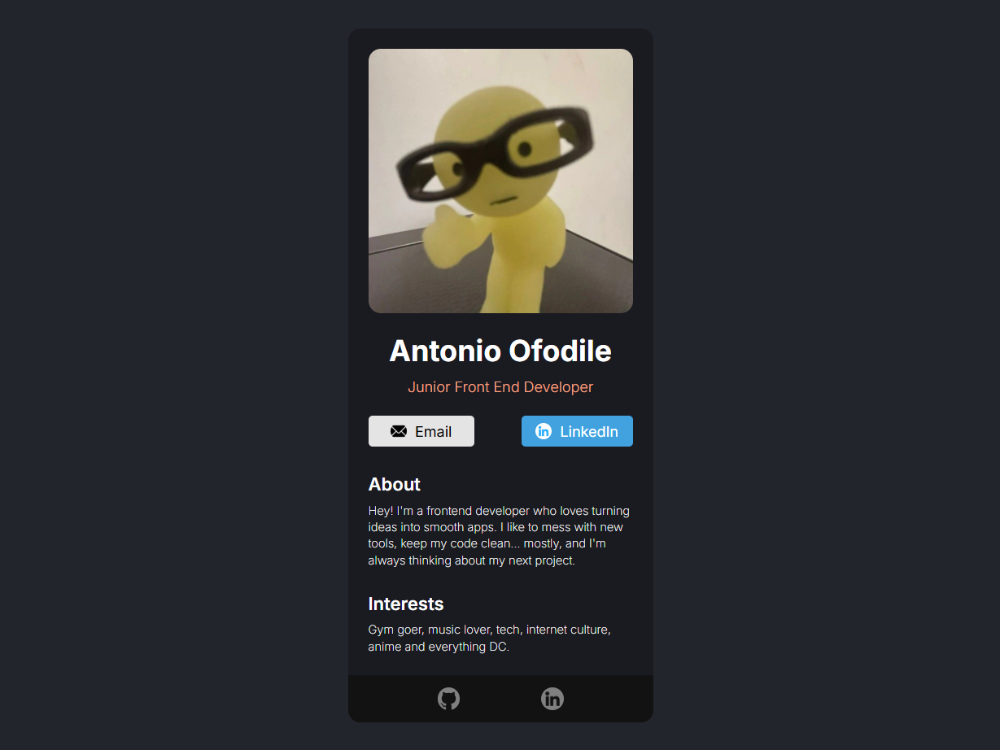

# Digital Business Card

A simple **React + Vite** project. My first React build while revisiting web development.  
It’s pretty much a fun digital business card with my info, links, and a clean minimal layout.  

👉 [Check it out here](https://business-card-xi-one.vercel.app/)

---

## 🖼️ Screenshot


---

## ⚙️ Tech Stack
- **React (with Vite)**
- **HTML5**
- **CSS3**

---

## 🚀 Setup Guide

1. Clone the repo:
   
   ```bash
   git clone https://github.com/AntoOfo/business-card
   cd business-card
   ```
   
2. Install dependencies:
   
   ```bash
   npm install
   ```
3. Run the dev server:

   ```bash
   npm run dev
   ```
